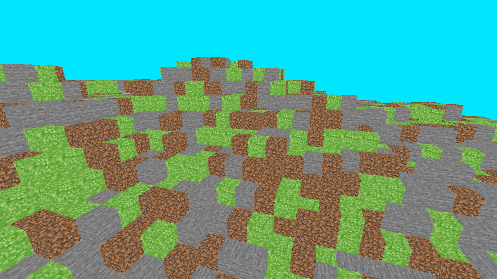

# Voxel Engine

Basically a look into how minecraft generates worlds. Voxels are generated randomly using a perlin noise algorithm.

## Features

- Perlin Noise World Generation
- Block culling and optimization
- Chunk loading and unloading
- Textures
- Player Movement
- Made from scratch

## How to run
You need to have [Java](https://www.java.com/en/) installed in order to run the `.jar` file. Download the file from the releases page, and run it!.

## Basic controls
Use WASD to move, Space to go up and Shift to go down.
Pressing tab unlocks the wireframe mode, but you have to be really precise with it.

## AI Usage
AI was used in the project to generate the voxel vertices and nothing else.

## Screenshot

I can't seem to figure out physics and collision just yet, but I hope to add that in a future release.
